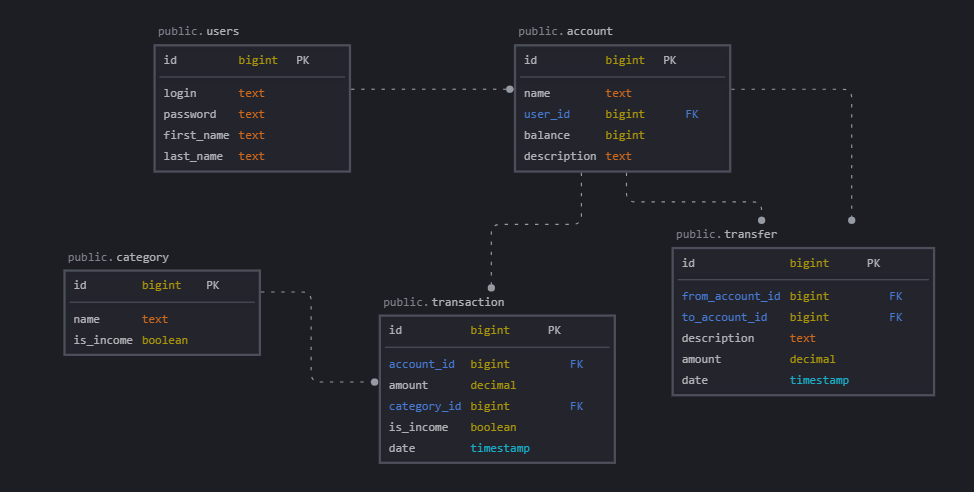

# Система учёта и анализа личных финансов

Веб-приложение для учёта доходов и расходов с аналитикой по категориям и периодам.



## Функциональность

- Регистрация, авторизация, выход из системы
- Управление счетами (создание, редактирование, удаление)
- Транзакции: добавление, редактирование, удаление, фильтрация по дате / категории / типу
- Переводы между счетами
- Управление категориями (доходные / расходные)
- Аналитика: сумма доходов/расходов за период, баланс, разбивка по категориям
- Роли: `USER` и `ADMIN`. Администратор управляет пользователями и просматривает статистику по системе
- Асинхронная генерация HTML-отчётов (POST `/reports`, GET `/reports/{id}`)

## Стек технологий

| Слой            | Технология                    |
|-----------------|-------------------------------|
| Backend         | Spring Boot 3, Spring MVC     |
| ORM             | Spring Data JPA / Hibernate   |
| БД              | PostgreSQL                    |
| Безопасность    | Spring Security, BCrypt       |
| Шаблонизатор    | Thymeleaf                     |
| Сборка          | Maven                         |
| Логирование     | SLF4J + Logback               |

## Запуск

### Предварительные требования

- JDK 21+
- Maven 3.9+
- PostgreSQL 15+

### 1. Создайте базу данных

```sql
CREATE DATABASE "analysis-nau";
CREATE USER "analysis-nau" WITH PASSWORD '12345';
GRANT ALL PRIVILEGES ON DATABASE "analysis-nau" TO "analysis-nau";
```

### 2. Настройте подключение

Отредактируйте `src/main/resources/application.properties`:

```properties
spring.datasource.url=jdbc:postgresql://localhost:5432/analysis-nau
spring.datasource.username=analysis-nau
spring.datasource.password=12345
```

### 3. Запустите приложение

```bash
./mvnw spring-boot:run
```

Приложение будет доступно по адресу: http://localhost:8080

Схема БД создаётся автоматически при первом запуске (`ddl-auto=update`).

## Архитектура

Слоистая архитектура:

```
Controller  →  Service  →  Repository  →  PostgreSQL
                ↑
              Entity / DTO
```

Пакеты:
- `controller` — HTTP-обработчики (Thymeleaf MVC + REST для отчётов)
- `service` — бизнес-логика
- `repository` — Spring Data JPA репозитории
- `entity` — JPA-сущности
- `dto` — формы и DTO
- `configuration` — Spring Security, слушатели событий безопасности

## API

### Веб-интерфейс (Thymeleaf)

| Метод | URL                        | Описание                          |
|-------|----------------------------|-----------------------------------|
| GET   | `/`                        | Главная / дашборд                 |
| GET   | `/transactions`            | Список транзакций (с фильтрами)   |
| GET   | `/transactions/new`        | Форма новой транзакции            |
| POST  | `/transactions/new`        | Создать транзакцию                |
| GET   | `/transactions/{id}/edit`  | Форма редактирования транзакции   |
| POST  | `/transactions/{id}/edit`  | Обновить транзакцию               |
| POST  | `/transactions/{id}/delete`| Удалить транзакцию                |
| GET   | `/accounts`                | Список счетов                     |
| GET   | `/accounts/new`            | Форма нового счёта                |
| GET   | `/accounts/{id}/edit`      | Форма редактирования счёта        |
| GET   | `/categories`              | Список категорий                  |
| GET   | `/transfers`               | Список переводов                  |
| POST  | `/transfers/new`           | Создать перевод                   |
| GET   | `/analytics`               | Страница аналитики                |
| GET   | `/admin/users`             | Управление пользователями (ADMIN) |
| GET   | `/admin/stats`             | Статистика системы (ADMIN)        |

### REST API

| Метод | URL             | Описание                                        |
|-------|-----------------|-------------------------------------------------|
| POST  | `/reports`      | Создать и запустить генерацию отчёта            |
| GET   | `/reports/{id}` | Получить содержимое отчёта (статус или HTML)    |

Spring Data REST также экспортирует `/data-rest/transaction` и `/data-rest/account` (доступно только роли `ADMIN`).

## Запуск через Docker

```bash
docker compose up --build
```

Приложение поднимет PostgreSQL и сам сервис. После старта открывайте http://localhost:8080.

Логи приложения монтируются в папку `./logs/` на хосте.

Остановка и удаление контейнеров:

```bash
docker compose down
```

Удаление вместе с данными БД:

```bash
docker compose down -v
```

## Тесты

```bash
./mvnw test
```

Включают:
- `TransactionServiceTest` — unit-тесты сервиса (Mockito)
- `TransactionRepositoryTest` — интеграционные тесты репозитория (требует запущенную БД)
- `TransactionControllerTest` — тесты контроллера через MockMvc
- `TransactionControllerRestAssuredTest` — REST-тесты через RestAssured
- `LoginUITest` — UI-тест формы входа (Selenium)
